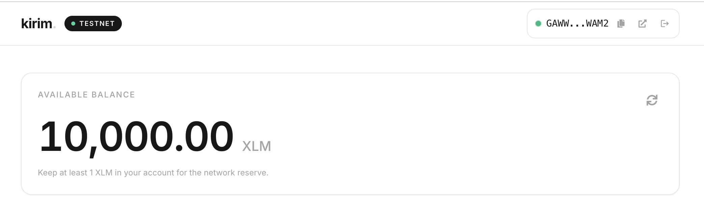
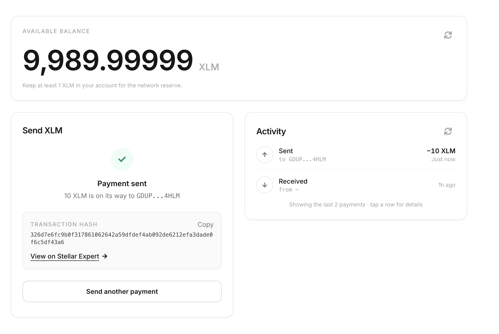
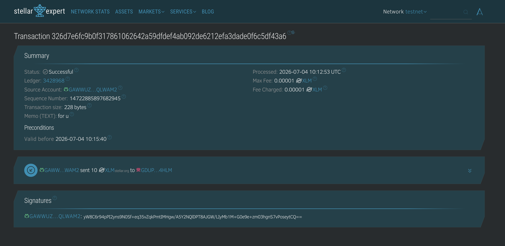

# kirim — Stellar Remittance dApp (Router + Escrow)

## 📖 Project description

**kirim** is a cross-border remittance dApp running live on the **Stellar testnet**, built across three levels of a Stellar hackathon. It lets anyone:

- **Connect / disconnect** a Stellar wallet — multi-wallet via Stellar Wallets Kit (Freighter, xBull, Albedo, Lobstr & more)
- **See their XLM balance** at a glance — new, unfunded accounts get a one-click **Fund with Friendbot** button
- **Send XLM payments** through a safe three-step flow: form → review & confirm → sign in the wallet
- **Send a claimable remittance through a fee router** — the **kirim-router** contract takes a small platform fee, then cross-contract-calls **kirim-escrow** to lock the net amount behind a one-time claim code, all in a **single wallet signature**
- **Claim or refund** — anyone with the claim code redeems it to their own wallet; unclaimed payments refund to the original sender after 24h
- **Watch contract activity in real time** — the dashboard polls Soroban RPC events across both contracts and shows every routed fee, escrow creation, claim, and refund as it happens, with toast notifications

The design is intentionally minimal: dominant white, hairline borders, near-black text, color reserved for meaning only. Template blockchain logic in `stellar-frontend-challenge/lib/stellar-helper.ts` is untouched; all contract-call logic is our own.

**🔗 Live demo:** https://stellar-learn-theta.vercel.app/

## 🏗 Architecture

```
                 1 wallet signature
                        │
                        ▼
 User ──► kirim-router.send_remittance(amount, claim_hash, expiry)
              │
              ├─ transfer fee → treasury               (platform revenue)
              │
              └─ cross-contract call ──► kirim-escrow.create_payment(user, net, claim_hash, expiry)
                                                │
                                                ├─ claim(secret)   → funds → recipient
                                                └─ refund()        → funds → user (after expiry)
```

The router calls the escrow with the **original user as `sender`**, not the router's own address — so a refund on an unclaimed payment still returns funds to the user, never to the router. This is verified on-chain (see the smoke test below) and by a dedicated contract test (`test_refund_after_routed_send_returns_to_user`).

## ⛓️ Deployed contracts (Stellar testnet)

| | |
|---|---|
| **kirim-router** | [`CCSVW2FTWP7UMB6EVSUUCZ3Y5I3JWHZXBWFJM3JMOT2C7GXSIP37Y6A6`](https://stellar.expert/explorer/testnet/contract/CCSVW2FTWP7UMB6EVSUUCZ3Y5I3JWHZXBWFJM3JMOT2C7GXSIP37Y6A6) — fee router, source in [`soroban-hello-world/contracts/kirim-router/`](soroban-hello-world/contracts/kirim-router/src/lib.rs) |
| **kirim-escrow** | [`CAPLG3MZG6LSH2VMGZHIQV7T5DP7RBJNQH44OLAUPIK3FDQHK5K5PW2Y`](https://stellar.expert/explorer/testnet/contract/CAPLG3MZG6LSH2VMGZHIQV7T5DP7RBJNQH44OLAUPIK3FDQHK5K5PW2Y) — hashlock escrow, source in [`soroban-hello-world/contracts/kirim-escrow/`](soroban-hello-world/contracts/kirim-escrow/src/lib.rs) |
| **Token** | Native XLM Stellar Asset Contract (no trustlines needed) |
| **Fee** | 1% (100 bps), admin-configurable up to 10%, treasury address is the deployer |
| **`send_remittance` tx (router → escrow, one signature)** | [`c4063049…8a39481`](https://stellar.expert/explorer/testnet/tx/c4063049db674d255522751e470e051134e3d3ec1626b998ae8fea8ba8a39481) |
| **`claim` tx** | [`e8c0c30f…86c62c1`](https://stellar.expert/explorer/testnet/tx/e8c0c30f983eea6ebc504d7fbdbcc53509f14932819c7269b2308bb5786c62c1) |

How it works: `send_remittance` takes the platform fee, then calls `create_payment` for the net amount, locking it behind `sha256(secret)` with a 24h expiry · `claim` pays out to any destination that presents the secret · `refund` returns expired escrows to the original sender. 19 Rust unit tests (8 escrow + 11 router) cover fee-splitting, cross-contract behavior, expiry, and admin controls.

## 📸 Screenshots

### 1. Wallet options available

Multi-wallet connect modal (Stellar Wallets Kit).


### 2. Wallet connected

Header chip with live status dot, copy, explorer link, and disconnect.


### 3. Balance displayed



### 4. Transaction result shown to the user

Success panel with amount, recipient, full transaction hash, and Stellar Expert link.



### 5. Successful testnet transaction

The same transaction confirmed on-chain on Stellar Expert.



### 6. Contract call with fee breakdown and status timeline

Sending a claimable remittance: live fee breakdown (amount / platform fee / recipient receives), status steps, and the one-time claim code.


### 7. Real-time contract events

Live feed of `routed` / `created` / `claimed` / `refunded` events polled across both contracts.


### 8. Mobile responsive UI

_(Level 3 submission requirement — capture the dashboard at a 375px viewport width.)_


### 9. CI/CD pipeline running

_(Level 3 submission requirement — capture a green run of `.github/workflows/ci.yml` in the Actions tab.)_


### 10. Test output (3+ passing)

_(Level 3 submission requirement — capture `cargo test --workspace` and/or `npm test` output.)_


## 🚀 Setup — run it locally

### Prerequisites

- **Node.js 18+**
- **Rust** + the `wasm32v1-none` target, and the [Stellar CLI](https://developers.stellar.org/docs/tools/cli) (only needed to touch the contracts)
- **A Stellar wallet extension** — [Freighter](https://freighter.app) recommended, switched to **Testnet** (Freighter → settings → *Network* → **Testnet**)

### Frontend

```bash
git clone <your-repo-url>
cd stellar-hack/stellar-frontend-challenge
npm install
npm run dev
```

Open [http://localhost:3000](http://localhost:3000). Both deployed contract ids are baked into `lib/config.ts`; override via `.env.local` (see `.env.example`) if you redeploy.

Try it:

1. **Connect** — pick your wallet in the modal.
2. **Fund** — new accounts get a *Fund with Friendbot* button.
3. **Send XLM** — recipient + amount → review → sign.
4. **Claimable payment → Send claimable** — enter an amount, see the live fee breakdown, sign once. The router takes its fee and locks the net amount in escrow. Copy the one-time claim code and watch the status timeline plus the live event feed (toasts appear for new activity).
5. **Claim with code** (from any connected wallet) to redeem it.

### Contracts

```bash
cd stellar-hack/soroban-hello-world
cargo test --workspace          # 19 unit tests (8 escrow + 11 router)
cargo fmt --check
cargo clippy --workspace --all-targets -- -D warnings
stellar contract build

# already deployed — re-run only if you want your own instances
./scripts/deploy-testnet.sh      # deploy + initialize kirim-escrow
./scripts/deploy-router.sh       # deploy + initialize kirim-router (points at kirim-escrow)
./scripts/smoke-test.sh          # on-chain create_payment → get_payment → claim
./scripts/smoke-test-router.sh   # on-chain send_remittance → get_payment → claim
```

### Frontend tests + lint

```bash
cd stellar-hack/stellar-frontend-challenge
npm run lint
npm test          # vitest — 27 tests across fee math, contract error mapping, and components
npm run build
```

### CI/CD

`.github/workflows/ci.yml` runs the same fmt/clippy/test and lint/test/build steps on every push and PR. `.github/workflows/deploy-contract.yml` is a manual (`workflow_dispatch`) job that redeploys either contract to testnet using a CI-only funded key (`secrets.STELLAR_DEPLOYER_SECRET_KEY`) — the demonstrable smart-contract deployment workflow. Vercel auto-deploys the frontend on every push to `main`.

## ✅ Requirement checklist

### Level 3

| Requirement | Where |
|-------------|-------|
| Advanced smart contract development | `kirim-router`: fee math, admin-configurable fee/treasury, disjoint error-code range (101+) from escrow |
| Inter-contract communication | `send_remittance` cross-contract-calls `kirim-escrow.create_payment` via a `#[contractclient]` trait (no wasm import, no export leakage — verified: router wasm exports exactly its own 5 functions) |
| Event streaming & real-time updates | `lib/useContractEvents.ts` — cursor-based incremental polling across both contracts in one `getEvents` call, exponential backoff on failure, pauses while the tab is hidden; new events surface as toasts (`components/Toaster.tsx`) |
| CI/CD pipeline | `.github/workflows/ci.yml` — contracts (fmt/clippy/test) + frontend (lint/test/build) jobs on every push/PR |
| Smart contract deployment workflow | `.github/workflows/deploy-contract.yml` (manual, CI-funded key) + `scripts/deploy-router.sh` / `scripts/deploy-testnet.sh` |
| Mobile responsive frontend | Tailwind breakpoints throughout; header collapses the Testnet badge below `sm`; escrow claim codes/hashes wrap with `break-all` |
| Error handling & loading states | `ContractCallError` taxonomy (wallet/contract/funds/network) spanning both contracts' error codes; shared `Skeleton` primitive; `app/error.tsx` App Router error boundary |
| Tests for contracts and frontend | 19 Rust unit tests (`cargo test --workspace`) + 27 Vitest tests (`npm test`) |
| Production-ready architecture practices | Parameterized contract-invoke pipeline, cached config reads, `.env.example`, disjoint error ranges instead of ad hoc string matching, CI gate before deploy |
| Documentation & demo presentation | This README, per-contract error-code tables below, demo video (link below) |

### Level 2

| Requirement | Where |
|-------------|-------|
| Contract deployed on testnet | `kirim-escrow` at `CAPLG3…PW2Y`, deployed via `soroban-hello-world/scripts/deploy-testnet.sh` |
| Contract called from the frontend | `lib/contract.ts` (simulate → sign → submit → confirm) used by `components/EscrowPanel.tsx` |
| Transaction status visible | Status timeline: *Prepare → Sign → Submit → Confirm* with live updates |
| 3+ error types handled | **wallet** (signing declined), **contract** (typed error codes across both contracts), **funds** (insufficient balance / unfunded account), **network** (RPC failure / confirmation timeout) |
| Real-time event integration | `lib/contract-events.ts` + `lib/useContractEvents.ts` poll Soroban RPC `getEvents` across both contracts; `components/ContractEvents.tsx` renders the live feed |
| Multi-wallet | Stellar Wallets Kit modal (Freighter, xBull, Albedo, Lobstr, …) |
| 2+ meaningful commits | 20+ feature-scoped commits across contracts, deploy scripts, frontend integration, tests, CI, and docs |

### Level 1

| Requirement | Where |
|-------------|-------|
| Freighter wallet setup on Testnet | Setup steps above |
| Wallet connect / disconnect | `components/WalletConnection.tsx` |
| Fetch & display XLM balance | `components/BalanceDisplay.tsx` + Friendbot funding (`lib/friendbot.ts`) |
| Send XLM tx + feedback with tx hash | `components/PaymentForm.tsx` — confirm step, success panel, explorer link |
| Development standards | TypeScript, inline error handling, loading skeletons, empty states, responsive |

## 🧭 Project structure

```
stellar-hack/
├── README.md
├── .github/workflows/            # ci.yml, deploy-contract.yml
├── screenshots/                  # Submission screenshots
├── stellar-frontend-challenge/   # Frontend (Next.js 14 + Tailwind)
│   ├── app/                      # Layout, dashboard page, error boundary
│   ├── components/               # Wallet, balance, send, escrow, events, toaster UI
│   │   └── *.test.tsx            # Component tests (vitest + RTL)
│   └── lib/
│       ├── stellar-helper.ts     # ⚠️ template blockchain logic (untouched)
│       ├── contract.ts           # router + escrow calls, error taxonomy (ours)
│       ├── contract.test.ts
│       ├── fees.ts               # pure fee-split math shared with the contract
│       ├── fees.test.ts
│       ├── contract-events.ts    # cursor-based multi-contract event polling
│       ├── useContractEvents.ts  # polling hook: backoff, visibility pause
│       ├── friendbot.ts          # Testnet faucet
│       └── config.ts             # Contract ids + RPC URL
└── soroban-hello-world/          # Soroban workspace (Rust)
    ├── contracts/
    │   ├── kirim-escrow/         # Hashlock escrow contract + 8 tests
    │   └── kirim-router/         # Fee router + cross-contract call + 11 tests
    └── scripts/                  # deploy-testnet.sh, deploy-router.sh, smoke-test*.sh
```

## 📋 Contract error codes

`kirim-escrow` uses 1–10, `kirim-router` uses 101+ — the ranges are disjoint on purpose so the frontend's single error table (`lib/contract.ts`) can map an `Error(Contract, #N)` to the right message regardless of which contract raised it.

| Code | Contract | Meaning |
|------|----------|---------|
| 1 | escrow | Already initialized |
| 2 | escrow | Not initialized |
| 3 | escrow | Payment with this claim hash already exists |
| 4 | escrow | No payment found for this claim hash |
| 5 | escrow | Invalid amount |
| 6 | escrow | Invalid expiry |
| 7 | escrow | Already claimed or refunded |
| 8 | escrow | Expired |
| 9 | escrow | Not yet expired (refund too early) |
| 10 | escrow | Wrong secret |
| 101 | router | Already initialized |
| 102 | router | Not initialized |
| 103 | router | Invalid amount |
| 104 | router | Invalid fee (over the 10% cap) |
| 105 | router | Net amount after fee is zero |

## 🎬 Demo video

_(1–2 min — link here once recorded.)_ Suggested script: connect wallet → enter an amount, show the live fee breakdown → sign once → point out the single signature covers both the fee transfer and the cross-contract escrow call → show the `routed`/`created` events landing in the live feed with a toast → claim from a second wallet → open the `send_remittance` tx on Stellar Expert to show both transfers in one transaction → show the GitHub Actions CI run green.

## 🛠 Tech stack

Next.js 14 · TypeScript · Tailwind CSS · Vitest + Testing Library · @stellar/stellar-sdk (Horizon + Soroban RPC) · Stellar Wallets Kit · Rust / soroban-sdk 26 · Stellar CLI · GitHub Actions · Vercel

---

⚠️ Testnet only — do not use real funds.
